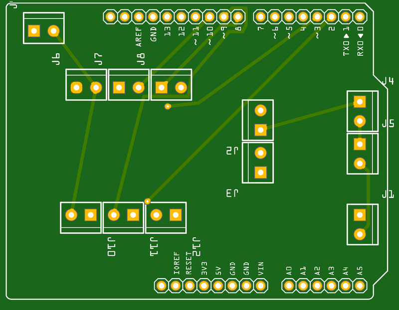
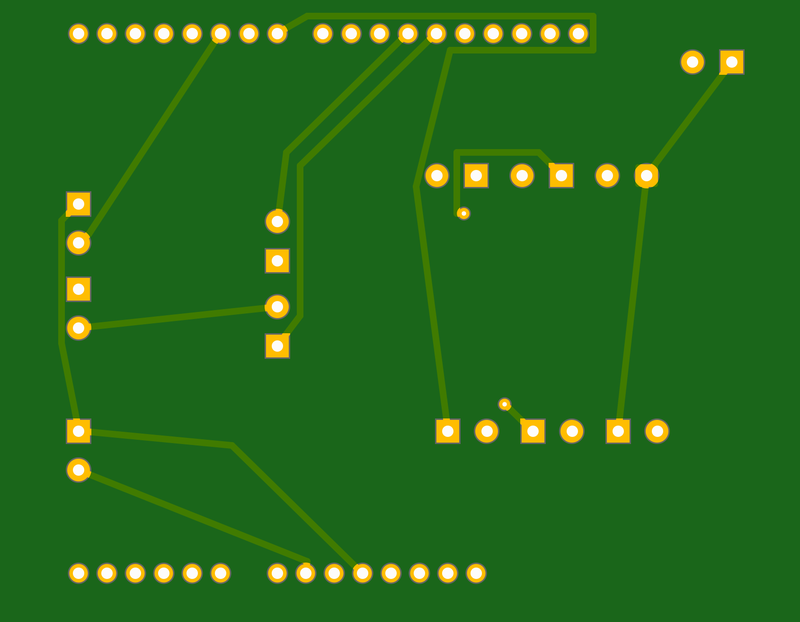

# Main-PCB

## About This Project

## Renderings

### Top

### Bottom

## BOM

|Count|Component|Details|Datasheet|
|-|-|-|-|
|13x|J2 / J3 / J4 / J5 / J6 / J7 / J8 / J9 / J1 / J10 / J11 / J12 / J13|350 Tb Wir Pro 180 Solid||
|1x|LED1|LED GREEN CLEAR 3MM ROUND T/H|[Link](http://www.semicon.panasonic.co.jp/ds4/LN38GCPX_E.pdf)|
|1x|R1|Res Thin Film 330 Ohm 1% 0.4W }50ppm/Ž Conformal Coated AXL Automotive Ammo|[Link](http://datasheet.octopart.com/MBA02040C3300FCT00-Vishay-datasheet-12542016.pdf)|

---

This project is managed and available on

You can view it [here](https://aisler.net/p/JCHJLQIR). Start your own Powerful Prototype on [here](https://aisler.net).
